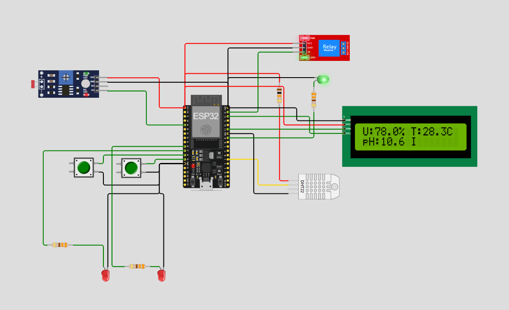

# FIAP - Faculdade de Informática e Administração Paulista

<p align="center">
<a href="https://www.fiap.com.br/"></a>
</p>

<br>

# **🌱 Projeto de Integração com IoT, Machine Learning e Cloud - Fase 7**

Este repositório reúne as entregas da **Fase 7 do curso 1TIAO**, consolidando as soluções das fases anteriores em um único sistema de gestão agrícola digital, com sensores físicos simulados, predição via IA e envio de alertas em tempo real com AWS.

---

## 👨‍🎓 Integrantes:

- [Edmar Ferreira Souza](https://www.linkedin.com/in/)
- [Alexandre Oliveira Mantovani](https://www.linkedin.com/in/alexomantovani)
- [Ricardo Lourenço Coube](https://www.linkedin.com/in/ricardolcoube/)
- [Jose Andre Filho](https://www.linkedin.com/in/joseandrefilho)
- [Enyd Bentivoglio](https://es.linkedin.com/in/enyd-bentivoglio-a47608364)

## 👩‍🏫 Professores:

- Tutor: [Leonardo Ruiz Orabona](https://www.linkedin.com/in/leonardoorabona)
- Coordenador: [André Godoi](https://www.linkedin.com/in/profandregodoi)

---

## 🎯 Objetivo do Projeto

Integrar em uma única aplicação os serviços desenvolvidos nas Fases 1 a 6, permitindo:

- Monitoramento de sensores via ESP32 (Wokwi)
- Análise preditiva de irrigação com machine learning
- Registro e envio de alertas via AWS SNS
- Interface gráfica para visualização (dashboard Streamlit)

---

## 🧩 Entregas por Fase

### ✅ Fase 1 - Cálculo de Área e Dados Agrícolas
- Scripts de cadastro de culturas
- Cálculo da área de plantio
- Integração com API de meteorologia

### ✅ Fase 2 - Banco de Dados Relacional
- Modelos MER e DER
- Scripts SQL de criação e amostragem

### ✅ Fase 3 - IoT com ESP32
- Simulação com sensores: umidade, temperatura, pH
- Comunicação MQTT com broker público
- Lógica de irrigação física via relé (Wokwi)

### ✅ Fase 4 - Dashboard + Machine Learning
- Predição de irrigação com algoritmo de classificação
- Interface com métricas, histórico e mapa
- Importância dos fatores exibida

### ✅ Fase 5 - Integração com Cloud AWS
- Envio de alertas para SNS via API HTTP
- Alertas com estrutura em JSON enviada diretamente ao endpoint

### ✅ Fase 6 - Visão Computacional
- Implementação de CNN e YOLO com imagens estáticas
- Análise comparativa dos modelos

### ✅ Fase 7 - Consolidação Final
- Execução centralizada via `main.py`
- Geração automática de alertas ao detectar `IRR = 1`
- Dashboard atualizado com abas dinâmicas e envio direto ao SNS

---

## ⚙️ Como Executar

1. **Clone o repositório**:
   Primeiro, faça o clone do repositório do projeto em seu ambiente local:
   ```bash
   git clone https://github.com/joseandrefilho/1TIAOR20242_FASE7_CAP1.git
   cd 1TIAOR20242_FASE3_CAP1
   ```

2. **Configuração do Banco de Dados**:
   Para criar as tabelas necessárias, execute os scripts SQL disponíveis na pasta `mer`:
   - No Oracle SQL Developer, execute o script `FarmTech_SCRIPT_DDL.sql` para criar o banco de dados e `FarmTech_SCRIPT_SampleData.sql` para inclusão dos registros iniciais de cultura e sensores.
   - Detalhes adicionais estão disponíveis no [README](mer/README.md) da pasta `mer`.

3. **Crie o tópico SNS**:
   Para criar o tópico SNS, você pode usar o console da AWS ou a AWS CLI. Aqui está um exemplo de como criar um tópico SNS usando a AWS CLI:
   ```bash
   aws sns create-topic --name AlertaIrrigacao
   ```

4. **Configurar variáveis de ambiente**:
   Crie um arquivo `.env` na raiz do projeto com as credenciais de acesso ao banco de dados Oracle:

   ```bash
   DB_USER=seu_usuario
   DB_PASSWORD=sua_senha
   DB_DSN=seu_dsn

   SNS_TOPIC_ARN=SeuTopicoARN
  AWS_REGION=Regiao
  AWS_ACCESS_KEY_ID=SeuAccessKeyID
  AWS_SECRET_ACCESS_KEY=SeuSecretAccessKey
   ```

4. **Instale as dependências**:
   Na raiz do projeto, instale as dependências listadas no arquivo `requirements.txt`:
   ```bash
   pip install -r requirements.txt
   ```

5. **Execute o projeto localmente**:
   Inicie o sistema rodando o arquivo `main.py` na pasta `src`:
   ```bash
   python src/main.py
   ```

6. **Execute o projeto no Wokwi**:
   Você pode visualizar e interagir com a simulação do projeto no Wokwi clicando na imagem abaixo:

   [](https://wokwi.com/projects/431525090602695681)

   Ou clique diretamente [aqui](https://wokwi.com/projects/431525090602695681) para acessar a simulação.

---

## 📦 Estrutura do Repositório

```
📁 mer/               # Modelagem de dados (MER, DER, SQL)
📁 src/            
 ├── 📁 mqtt/         # Cliente MQTT que recebe os dados do ESP32
 ├── 📁 utils/        # Dashboard Streamlit e utilitários
 ├── 📁 models/       # Entidades: sensores, leitura, irrigação, alerta
 ├── 📁 ml/           # Preditor de irrigação com sklearn
 ├── 📁 db/           # Conexão com banco
 ├── 📄 dashboard.py  # Executa dashboard
 ├── 📄 main.py       # Executa dashboard + MQTT
📁 wokwi/             # Simulação do ESP32
📄 README.md          # Documentação completa
```
---

## 📤 Envio de Alertas (AWS SNS)

- Quando o ESP32 ativa a irrigação (`IRR == 1`), um alerta é:
  - Gravado na tabela `T_SSA_ALERTAS`
  - Enviado via boto3 para o SNS

---

## 🎥 Vídeo de Apresentação

🔗 [Link para o vídeo (YouTube - não listado)](https://youtu.be/jdzTJdaG_U8)

---

## 📚 Tecnologias Usadas

- Python 3.10
- Streamlit
- Scikit-Learn
- MQTT (paho-mqtt)
- SQLite e Oracle SQL Developer
- AWS SNS via boto3
- Wokwi (simulação ESP32)

---

## 📝 Licença

<p xmlns:cc="http://creativecommons.org/ns#" xmlns:dct="http://purl.org/dc/terms/">
Este projeto segue o modelo FIAP e está licenciado sob 
<a href="http://creativecommons.org/licenses/by/4.0/?ref=chooser-v1" target="_blank" rel="license noopener noreferrer">Attribution 4.0 International (CC BY 4.0)</a>.
</p>
