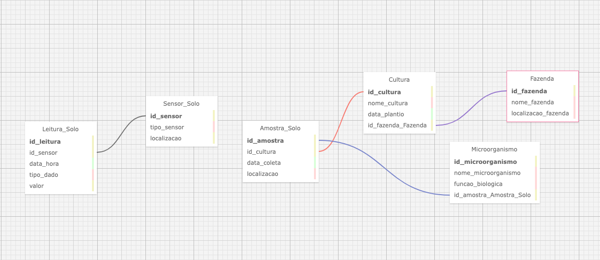

# FIAP - Faculdade de Informática e Administração Paulista

    <a href= "https://www.fiap.com.br/"><a>

 

# Monitoramento da saúde do solo e seu bioma microbiano para otimização da produção agrícola

## Grupo 71

## 👨‍🎓 Integrantes:

- <a href="https://www.linkedin.com/in/alexomantovani">Alexandre Oliveira Mantovani</a>
- <a href="https://www.linkedin.com/company/inova-fusca">Ricardo Coube</a>
- <a href="https://www.linkedin.com/company/inova-fusca">Thiago Lima Bernardes</a>
- <a href="https://www.linkedin.com/company/inova-fusca">Edmar Ferreira Souza</a>

## 👩‍🏫 Professores:

### Tutor(a)

- ⁠<a href="https://www.linkedin.com/in/lucas-gomes-moreira-15a8452a/">Lucas Gomes Moreira</a>

### Coordenador(a)

- ⁠<a href="https://www.linkedin.com/in/profandregodoi/">André Godoi</a>

## 📜 Descrição

Este projeto é um sistema de coleta e processamento dados sobre a composição do solo e sua microbiota, monitorando aspectos como diversidade de microrganismos, condições de nutrientes e alterações ao longo do tempo.
A saúde do solo é fundamental para uma boa produtividade, e a análise da presença de microrganismos benéficos e patogênicos permite ao sistema identificar possíveis intervenções,
como a adição de fertilizantes orgânicos ou o manejo de pragas de solo.

## 📁 Estrutura de pastas

Dentre os arquivos e pastas presentes na raiz do projeto, definem-se:

- <b>logo-fiap.png</b>: Arquivo imagem apresentado no inicio do README.md do repositório.

- <b>Grupo-71.png</b>: Arquivo imagem apresentado ao final do README.md do repositório representando a modelagem de daods do Diagrama Entidade Relacionamento feito no SQLDesigner.

- <b>Grupo-71.xml</b>: Arquivo xml que representa a modelagem de dados do Diagrama Entidade Relacionamento feito no SQLDesigner.

- <b>Grupo-71.sql</b>: Arquivo SQL representa a modelagem de dados do Diagrama Entidade Relacionamento feito no SQLDesigner.

- <b>README.md</b>: arquivo que serve como guia e explicação geral sobre o projeto (o mesmo que você está lendo agora).

### Dados Necessários:

- Leituras de sensores biológicos que coletam dados sobre a diversidade de microrganismos presentes no solo.
- Análises químicas do solo para medir níveis de nutrientes, pH e matéria orgânica.
- Histórico de intervenções no solo, como aplicação de fertilizantes, compostagem ou irrigação.
- Dados climáticos (temperatura, umidade) que influenciam as condições microbiológicas do solo.
- Tipo de cultura plantada e produtividade agrícola, associando os dados do solo com o desempenho da safra.

Esses dados permitem a criação de um panorama detalhado da saúde do solo, e o sistema pode sugerir intervenções para melhorar as condições microbianas, promovendo o equilíbrio do bioma do solo e uma produção mais sustentável.

## Entidades e Atributos

Abaixo estão as entidades necessárias para representar essa solução em um modelo de banco de dados:

### Entidade: Sensor_Solo

Essa entidade armazena informações sobre os sensores utilizados para coletar dados microbiológicos e químicos do solo.

- **id_sensor (PK)** – Identificador único do sensor. (tipo: INT)
- **tipo_sensor** – Tipo do sensor (biológico, químico, de umidade, etc.). (tipo: VARCHAR)
- **localizacao** – Localização do sensor no campo (latitude, longitude). (tipo: VARCHAR)

### Entidade: Leitura_Solo

Armazena os dados coletados pelos sensores de solo, tanto microbiológicos quanto químicos.

- **id_leitura (PK)** – Identificador único da leitura. (tipo: INT)
- **id_sensor (FK)** – Identificador do sensor que coletou a leitura. (tipo: INT)
- **data_hora** – Data e hora da leitura. (tipo: DATETIME)
- **tipo_dado** – Tipo de dado coletado (diversidade microbiana, pH, níveis de nutrientes, etc.). (tipo: VARCHAR)
- **valor** – Valor registrado pelo sensor. (tipo: DOUBLE)

### Entidade: Microorganismo

Essa entidade representa os diferentes microrganismos detectados no solo.

- **id_microorganismo (PK)** – Identificador único do microrganismo. (tipo: INT)
- **nome_microorganismo** – Nome científico do microrganismo. (tipo: VARCHAR)
- **funcao_biologica** – Função que o microrganismo desempenha no solo (ex.: decompositor, fixador de nitrogênio, patógeno). (tipo: VARCHAR)

### Entidade: Cultura

Armazena as informações sobre as culturas plantadas em determinada área de solo.

- **id_cultura (PK)** – Identificador único da cultura plantada. (tipo: INT)
- **nome_cultura** – Nome da cultura (milho, soja, etc.). (tipo: VARCHAR)
- **data_plantio** – Data de plantio da cultura. (tipo: DATE)

### Entidade: Amostra_Solo

Armazena informações sobre amostras de solo coletadas para análises laboratoriais mais detalhadas, como sequenciamento de DNA do solo para estudos microbiológicos.

- **id_amostra (PK)** – Identificador único da amostra. (tipo: INT)
- **id_cultura (FK)** – Identificador da cultura associada. (tipo: INT)
- **data_coleta** – Data da coleta da amostra de solo. (tipo: DATETIME)
- **localizacao** – Localização geográfica da amostra. (tipo: VARCHAR)

### Entidade: Fazenda

Representa as fazendas monitoradas no sistema.

- **id_fazenda (PK)** – Identificador único da fazenda. (tipo: INT)
- **nome_fazenda** – Nome da fazenda. (tipo: VARCHAR)
- **localizacao_fazenda** – Localização da fazenda (endereço, cidade, estado). (tipo: VARCHAR)

## Cardinalidade dos Atributos

A cardinalidade entre as entidades define as relações entre elas:

- Um sensor pode realizar muitas leituras de solo ao longo do tempo (1).
- Uma cultura pode estar associada a muitas amostras de solo (1).
- Uma amostra de solo pode ter muitos microrganismos identificados (1).
- Uma fazenda pode ter muitos sensores e culturas associados (1).

## Relacionamento entre as Entidades (MER)

Aqui estão os principais relacionamentos entre as entidades no Modelo Entidade-Relacionamento (MER):

- **Sensor_Solo 1** → **Leitura_Solo:** Um sensor pode realizar várias leituras ao longo do tempo.
- **Cultura 1** → **Amostra_Solo:** Uma cultura pode ter várias amostras de solo associadas para análise.
- **Amostra_Solo 1** → **Microorganismo:** Uma amostra de solo pode identificar vários microrganismos diferentes.
- **Fazenda 1** → **Cultura:** Uma fazenda pode cultivar diferentes culturas ao longo do tempo.

Esses relacionamentos formam a base para o monitoramento detalhado da saúde do solo e sua microbiota.

## Tipos de Dados a Serem Gravados

Aqui estão os tipos de dados que serão usados para armazenar as informações no banco de dados:

| Entidade       | Atributo            | Tipo de Dado |
| -------------- | ------------------- | ------------ |
| Sensor_Solo    | id_sensor           | INT          |
|                | tipo_sensor         | VARCHAR      |
|                | localizacao         | VARCHAR      |
| Leitura_Solo   | id_leitura          | INT          |
|                | id_sensor           | INT (FK)     |
|                | data_hora           | DATETIME     |
|                | tipo_dado           | VARCHAR      |
|                | valor               | DOUBLE       |
| Microorganismo | id_microorganismo   | INT          |
|                | nome_microorganismo | VARCHAR      |
|                | funcao_biologica    | VARCHAR      |
| Cultura        | id_cultura          | INT          |
|                | nome_cultura        | VARCHAR      |
|                | data_plantio        | DATE         |
| Amostra_Solo   | id_amostra          | INT          |
|                | id_cultura          | INT (FK)     |
|                | data_coleta         | DATETIME     |
|                | localizacao         | VARCHAR      |
| Fazenda        | id_fazenda          | INT          |
|                | nome_fazenda        | VARCHAR      |
|                | localizacao_fazenda | VARCHAR      |

## DER

    

## 🗃 Histórico de lançamentos

* 1.0.0 - 16/10/2024
    * 
* 0.1.0 - 07/10/2024
    *

## 📋 Licença

<a property="dct:title" rel="cc:attributionURL" href="https://github.com/agodoi/template">MODELO GIT FIAP</a> por <a rel="cc:attributionURL dct:creator" property="cc:attributionName" href="https://fiap.com.br">Fiap</a> está licenciado sobre <a href="http://creativecommons.org/licenses/by/4.0/?ref=chooser-v1" target="_blank" rel="license noopener noreferrer" style="display:inline-block;">Attribution 4.0 International</a>.

