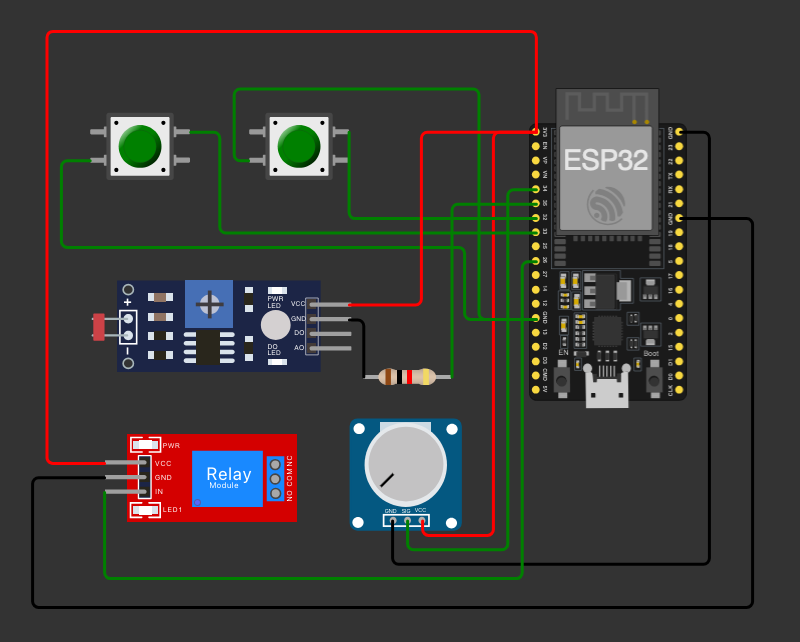

# FIAP - Faculdade de Informática e Administração Paulista

 

# Construindo uma Máquina Agrícola

## Nome do grupo

## 👨‍🎓 Integrantes:

- <a href="https://www.linkedin.com/company/">Edmar Ferreira Souza</a>
- <a href="https://www.linkedin.com/company/">Thiago Lima Bernardes</a>
- <a href="https://www.linkedin.com/company/">Alexandre Oliveira Mantovani</a>
- <a href="https://www.linkedin.com/company/">Ricardo Lourenço Coube</a>

## 👩‍🏫 Professores:

### Tutor(a)

- <a href="https://www.linkedin.com/in/lucas-gomes-moreira-15a8452a/">Lucas Gomes Moreira</a>

### Coordenador(a)

- <a href="https://www.linkedin.com/in/profandregodoi/">André Godoi</a>

## 📜 Descrição

Este projeto consiste em um sistema de monitoramento e controle de irrigação automática com coleta de dados de solo, armazenamento e análise de dados para otimização do uso de recursos hídricos e nutrientes.
Ele é dividido em três componentes principais: Controle e Coleta de Dados (ESP32 e Sensores), Armazenamento e Manipulação de Dados (MySQL e Python) e Análise e Visualização (Dashboard com Python e R).

## 📁 Estrutura de pastas

Dentre os arquivos e pastas presentes na raiz do projeto, definem-se:

- <b>assets</b>: aqui estão os arquivos relacionados a elementos não-estruturados deste repositório, como imagens.

- <b>README.md</b>: arquivo que serve como guia e explicação geral sobre o projeto (o mesmo que você está lendo agora).

## 🔧 Como executar o código

1. Abra o script do programa "api.py"
2. Configure as credenciais do banco de dados no local indicado.
3. Baixe e configure o MySql com suas credenciais de conexão.
4. Execute o "create_table.sql".
5. Execute o programa "api.py"
6. Execute o programa "dashbord.py"
7. Execute o programa "dashboard.R"

### Funcionalidades

Controle e Coleta de Dados (ESP32 e Sensores): Utilizando um ESP32, o sistema monitora a umidade do solo, níveis de nutrientes (P e K) e pH, além de controlar uma bomba de água. Quando a umidade está baixa e um dos nutrientes estão presentes, a bomba é ativada automaticamente. Os dados coletados são exibidos em tempo real no Monitor Serial.

Conexão com Banco de Dados: Conecta-se ao banco de dados MySql para armazenar e manipular dados coletados do sistema de irrigação.

CRUD de dados do Sistema de Irrigação:  
Este módulo permite registrar e consultar os dados dos sensores, mantendo um histórico para análise posterior.

Dashboard com Python e R:
Um script Python exporta os dados para um arquivo CSV, que é utilizado em um script R para gerar gráficos e análises dos níveis de umidade e pH ao longo do tempo,
facilitando a visualização e o entendimento das condições do solo.

Funções Principais

conectar(): Realiza a conexão com o banco de dados.
inserir_dados(umidade, nutrienteP, nutrienteK, ph, irrigacaoAtiva): Realiza o registro dos dados obtidos pelo Sistema de irrigação.
ler_dados(): Retorna todos os registros por ordem de descendente de registro.
exportar_para_csv(): Exporta os dados da consulta para um arquivo .csv que será utilizado para análise e visualização de dados.

## 🗃 Histórico de lançamentos

- 1.0.0 - 10/11/2024

## ▶️ YouTube

- <a href="https://youtu.be/gs1GEXbf4UA">Sistema de Irrigação</a>

## 📋 Licença

<a property="dct:title" rel="cc:attributionURL" href="https://github.com/agodoi/template">MODELO GIT FIAP</a> por <a rel="cc:attributionURL dct:creator" property="cc:attributionName" href="https://fiap.com.br">Fiap</a> está licenciado sobre <a href="http://creativecommons.org/licenses/by/4.0/?ref=chooser-v1" target="_blank" rel="license noopener noreferrer" style="display:inline-block;">Attribution 4.0 International</a>.

