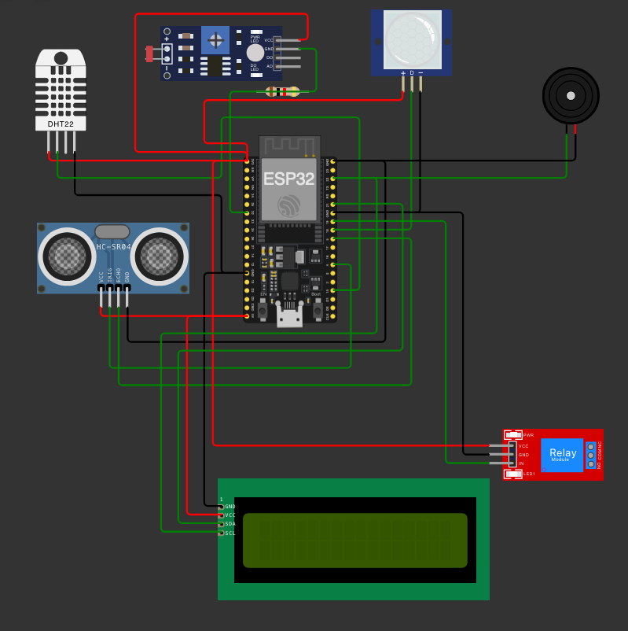
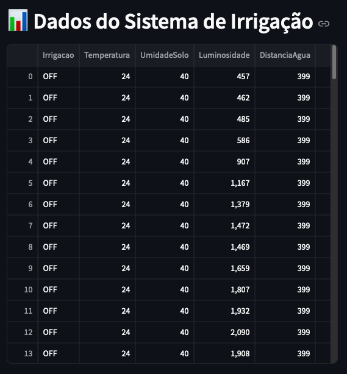
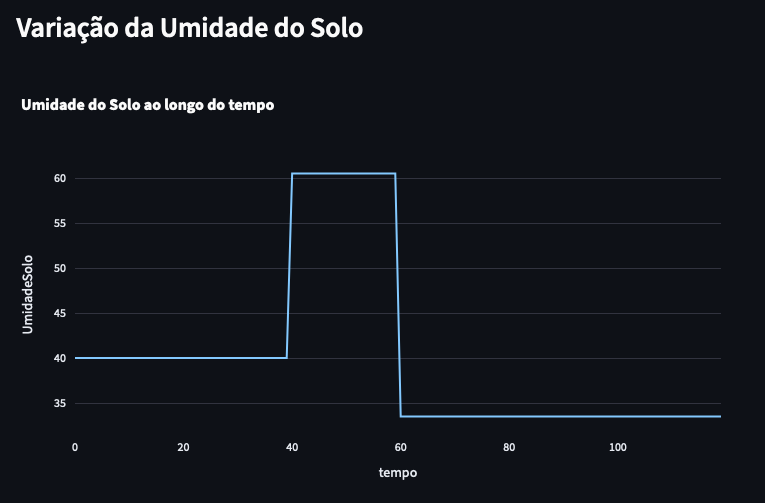
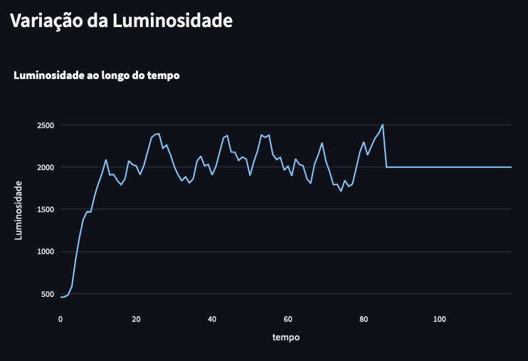
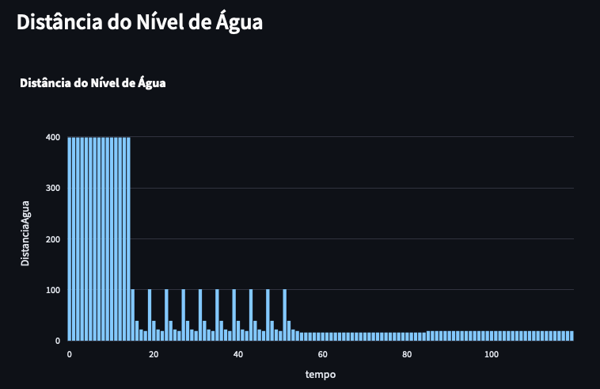
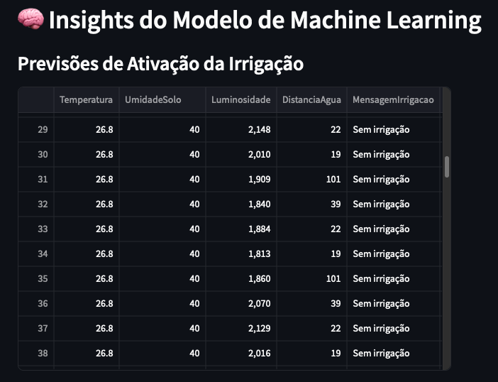

# FIAP - Faculdade de Informática e Administração Paulista

 

# Construindo uma Máquina Agrícola

## Nome do grupo

## 👨‍🎓 Integrantes:

- <a href="https://www.linkedin.com/in/alexomantovani/">Alexandre Oliveira Mantovani</a>
- <a href="https://br.linkedin.com/in/ricardolcoube/">Ricardo Lourenço Coube</a>
- <a href="https://www.linkedin.com/company/">Edmar Ferreira Souza</a>

## 👩‍🏫 Professores:

### Tutor(a)

- <a href="https://www.linkedin.com/in/lucas-gomes-moreira-15a8452a/">Lucas Gomes Moreira</a>

### Coordenador(a)

- <a href="https://www.linkedin.com/in/profandregodoi/">André Godoi</a>

## 📜 Descrição

Este projeto consiste em um sistema de monitoramento e controle de irrigação automática com coleta de dados de solo, armazenamento e análise de dados para otimização do uso de recursos hídricos e nutrientes.
Ele é dividido em três componentes principais: Controle e Coleta de Dados (ESP32 e Sensores), Armazenamento e Manipulação de Dados (MySQL e Python) e Análise e Visualização (Dashboard com Python e R).

## 📁 Estrutura de pastas

Dentre os arquivos e pastas presentes na raiz do projeto, definem-se:

- <b>assets</b>: aqui estão os arquivos relacionados a elementos não-estruturados deste repositório, como imagens.

- <b>README.md</b>: arquivo que serve como guia e explicação geral sobre o projeto (o mesmo que você está lendo agora).

## 🔧 Como executar o código

1. Abra o script do programa "api.py"
2. Configure as credenciais do banco de dados no local indicado.
3. Baixe e configure o MySql com suas credenciais de conexão.
4. Execute o "create_table.sql".
5. Execute o programa "api.py"
6. Execute o programa "dashbord.py"
7. Execute o programa "dashboard.R"

### Funcionalidades

Controle e Coleta de Dados (ESP32 e Sensores): Utilizando um ESP32, o sistema monitora a umidade do solo, níveis de nutrientes (P e K) e pH, além de controlar uma bomba de água. Quando a umidade está baixa e um dos nutrientes estão presentes, a bomba é ativada automaticamente. Os dados coletados são exibidos em tempo real no Monitor Serial.

Clique na imagem acima para abrir o sistema no Wowki

Conexão com Banco de Dados: Conecta-se ao banco de dados MySql para armazenar e manipular dados coletados do sistema de irrigação.

CRUD de dados do Sistema de Irrigação:  
Este módulo permite registrar e consultar os dados dos sensores, mantendo um histórico para análise posterior.

Dashboard com Python e R:
Um script Python exporta os dados para um arquivo CSV, que é utilizado em um script R para gerar gráficos e análises dos níveis de umidade e pH ao longo do tempo,
facilitando a visualização e o entendimento das condições do solo.

Funções Principais

- **conectar()**: Realiza a conexão com o banco de dados.
- **inserir_dados(umidade, nutrienteP, nutrienteK, ph, irrigacaoAtiva)**: Realiza o registro dos dados obtidos pelo Sistema de irrigação.
- **ler_dados()**: Retorna todos os registros por ordem de descendente de registro.
- **exportar_para_csv()**: Exporta os dados da consulta para um arquivo .csv que será utilizado para análise e visualização de dados.

## 🔥 Novas Funcionalidades Implementadas

### **Banco de Dados**

- **Tabelas Adicionadas**:

  - `DadosSensores`: Registro detalhado de temperatura, umidade, luminosidade, nível de água e estado da irrigação.
  - `DecisoesIrrigacao`: Registro das previsões e decisões do sistema baseadas no modelo de Machine Learning.
  - `Logs`: Registro de eventos importantes como alertas, erros e ações realizadas pelo sistema.

- **Melhorias**:
  - Adição de relacionamentos entre as tabelas para otimizar consultas.
  - Novos índices criados para melhorar o desempenho na busca por dados históricos.

### **API**

- **Novos Endpoints**:

  - **Inserção de dados dos sensores**: Endpoint para registrar leituras de temperatura, umidade, luminosidade e nível de água.
  - **Registro de decisões de irrigação**: Armazena previsões do modelo de ML e as mensagens associadas.
  - **Consulta de logs**: Permite a análise dos eventos registrados pelo sistema.

- **Melhorias**:
  - Conexão com o banco de dados MySQL otimizada para suportar maior volume de requisições.
  - Validação de dados recebidos para evitar inconsistências nos registros.

### **Modelo de Machine Learning**

- **Características**:

  - Implementado um modelo de classificação com Random Forest para prever quando ativar a irrigação.
  - Acurácia de **95%** nos testes com dados históricos simulados.

- **Melhorias**:
  - Processamento dos dados de entrada para normalizar variáveis e melhorar o desempenho do modelo.
  - Exportação do modelo treinado para um arquivo `.pkl` para uso contínuo na API e no dashboard.

### **Dashboard (Streamlit)**

- **Visualização de Dados em Tempo Real**:

  - Exibe os dados coletados pelos sensores, incluindo:
    - **Temperatura** (ºC).
    - **Umidade do Solo** (%).
    - **Luminosidade** (%).
    - **Distância do Nível de Água** (cm).
  - Apresenta uma tabela dinâmica com os dados mais recentes.

- **Gráficos Interativos**:

  - **Variação da Umidade do Solo**:
    - Um gráfico de linha mostra as alterações na umidade do solo ao longo do tempo.
    - Facilita a identificação de padrões sazonais ou eventos críticos.
  - **Variação da Luminosidade**:
    - Gráfico de linha interativo, útil para correlacionar luz solar com evaporação do solo.
  - **Distância do Nível de Água**:
    - Gráfico de barras que monitora a variação do nível da água no reservatório.

- **Previsões de Machine Learning**:

  - Integração com o modelo Random Forest para prever:
    - Ativação do sistema de irrigação com base em condições ambientais.
  - Mensagens descritivas são exibidas, como:
    - _"Irrigado às 10:30"_ ou _"Sem irrigação"_.
  - Permite análise das decisões do sistema de forma rápida e eficiente.

- **Exportação de Dados**:
  - Os usuários podem exportar os dados visualizados para um arquivo CSV, garantindo maior flexibilidade na análise.

### **Integração do Serial Plotter**

- O sistema agora utiliza o Serial Plotter para monitorar variáveis como temperatura, umidade, luminosidade e distância em tempo real, durante simulações realizadas no Wokwi.
- Esta funcionalidade facilita a análise gráfica das condições do sistema, permitindo ajustes e validação eficiente.

### Melhorias e Otimizações

- Implementação de gráficos claros e normalizados no Serial Plotter, garantindo consistência e fácil leitura.
- Otimização do código para enviar dados diretamente ao Serial Plotter em intervalos regulares.
- Simulações detalhadas com condições variáveis para validar o sistema.

## 📊 Demonstrações

### Capturas de Tela do Dashboard

- **Tabela de Dados em Tempo Real**:
  

  
  

- **Gráfico de Umidade do Solo**:
  

  
  

- **Gráfico de Luminosidade**:
  

  
  

- **Gráfico do Nível de Água**:
  

  
  

- **Decisões do Modelo de ML**:
  

  
  

## 📊 Demonstração do Serial Plotter

### Descrição Geral

O Serial Plotter foi utilizado para monitorar as seguintes variáveis:

- **Temperatura (ºC)**
- **Umidade (%)**
- **Luminosidade (%)**
- **Distância (cm)**

### Capturas de Tela do Serial Plotter

- **Captura 1**:

  - **Contexto**: Temperatura baixa (10,1°C) e umidade moderada (55%).
  - **Observação**: A temperatura permanece estável, enquanto a umidade apresenta pequenas oscilações.
  

  
  

- **Captura 2**:

  - **Contexto**: Temperatura elevada (30,4°C) e aumento na umidade (68,5%).
  - **Observação**: Curvas de temperatura e umidade com inclinação ascendente.
  

  
  

- **Captura 3**:
  - **Contexto**: Sensor ultrassônico detectando objeto a 197 cm.
  - **Observação**: Linha de distância com transição clara ao atingir o novo valor.
  

  
  

### Observações Técnicas

- **Resolução do Serial Plotter**: Ideal para protótipos, mas pode apresentar limitações em projetos mais complexos devido à sobreposição de dados.
- **Escalabilidade**: Para sistemas maiores, é recomendada a integração com dashboards interativos.

### Como Utilizar o Serial Plotter

1. **Configuração Inicial**:

   - Abra o projeto no Wokwi [link para o projeto](https://wokwi.com/projects/416283906351427585).
   - Certifique-se de que o ESP32 está configurado corretamente no ambiente.

2. **Execução**:

   - Compile e execute o código do ESP32.
   - Abra o Serial Plotter na IDE para visualizar os gráficos em tempo real.

3. **Interpretação dos Gráficos**:
   - As variáveis são plotadas com cores distintas para facilitar a análise.
   - Valores como picos e quedas podem indicar mudanças no ambiente monitorado.

---

## 🗃 Histórico de lançamentos

- 1.0.0 - 10/11/2024
- 1.0.1 - 01/12/2024
- 1.0.3 - 06/12/2024

## ▶️ YouTube

## 📋 Licença

<a property="dct:title" rel="cc:attributionURL" href="https://github.com/agodoi/template">MODELO GIT FIAP</a> por <a rel="cc:attributionURL dct:creator" property="cc:attributionName" href="https://fiap.com.br">Fiap</a> está licenciado sobre <a href="http://creativecommons.org/licenses/by/4.0/?ref=chooser-v1" target="_blank" rel="license noopener noreferrer" style="display:inline-block;">Attribution 4.0 International</a>.

