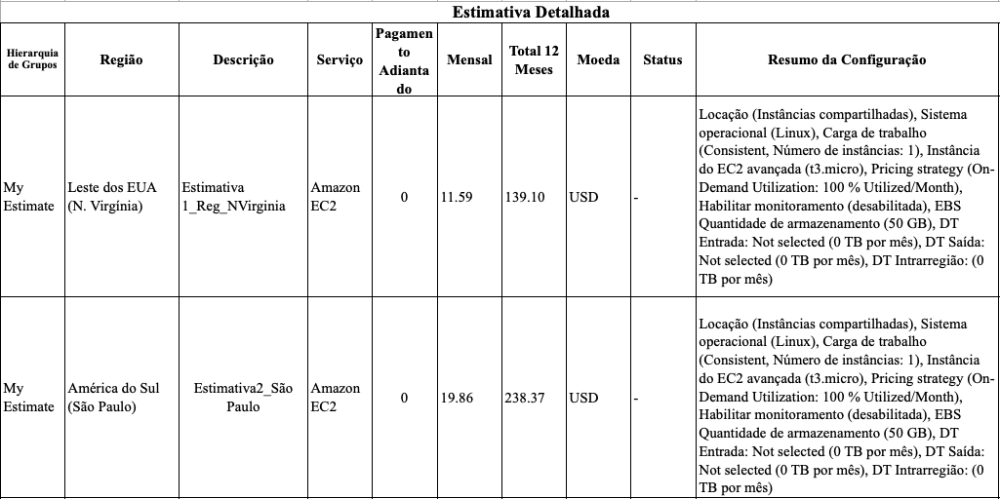

# FIAP - Faculdade de Informática e Administração Paulista

<p align="center">
<a href= "https://www.fiap.com.br/"></a>
</p>

<br>

# FarmTech na era da cloud computing

## Nome do grupo

## 👨‍🎓 Integrantes:

- <a href="https://www.linkedin.com/in/">Edmar Ferreira Souza</a>
- <a href="https://www.linkedin.com/in/alexomantovani">Alexandre Oliveira Mantovani</a>
- <a href="https://www.linkedin.com/in/ricardolcoube/">Ricardo Lourenço Coube</a>

## 👩‍🏫 Professores:

### Tutor(a)

- <a href="https://https://www.linkedin.com/in/leonardoorabona/">Leonardo Ruiz Orabona</a>

### Coordenador(a)

- <a href="https://www.linkedin.com/in/profandregodoi/">André Godoi</a>

## 📜 Descrição

Este projeto tem como objetivo prever o rendimento de diferentes safras agrícolas em uma fazenda de médio porte, utilizando técnicas de Machine Learning. A base de dados utilizada contém informações sobre as condições de solo e temperatura, e o rendimento da safra. O objetivo principal é construir modelos preditivos para estimar o rendimento da safra com base em variáveis ambientais e climáticas.

## 📁 Estrutura de pastas

Dentre os arquivos e pastas presentes na raiz do projeto, definem-se:

- <b>assets</b>: aqui estão os arquivos relacionados a elementos não-estruturados deste repositório, como imagens.

- <b>README.md</b>: arquivo que serve como guia e explicação geral sobre o projeto (o mesmo que você está lendo agora).

## 🔧 Como executar o código

## Link Jupyter Notebook

- <a href="https://jupyter.org/try-jupyter/notebooks/?path=EdmarFerreiraDeSouza_rm560406_pbl_fase4.ipynb">EdmarFerreiraDeSouza_rm560406_pbl_fase4.ipynb</a>

Ou então você pode executar este projeto localmente, você precisará de um ambiente Python com as seguintes bibliotecas instaladas:

- Pandas
- NumPy
- Matplotlib
- Seaborn
- Scikit-learn
- XGBoost
- KMeans
- StandardScaler
- XGBRegressor
- DBSCAN
- MLPRegressor

Execute o código Python no Jupyter Notebook para ver a análise e modelagem completa.

## Instalação de dependências

```bash
pip install -r requirements.txt
```

## Estrutura do Projeto

1. **Análise Exploratória de Dados (EDA)**:
   - Entendimento das variáveis.
   - Visualização de distribuições e correlações.
   - Identificação de outliers e padrões nas variáveis.
2. **Modelagem Preditiva**:
   - Utilização de 5 diferentes algoritmos de Machine Learning para prever o rendimento da safra.
   - Avaliação de cada modelo com métricas de desempenho.
3. **Clustering (Machine Learning Sem Supervisão)**:
   - Exploração de tendências e agrupamento de safras com base em suas características climáticas.
4. **Conclusões**:
   - Análise de pontos fortes e limitações dos modelos.
   - Possíveis melhorias para o trabalho futuro.
5. **Estimativa de custos on-demand (AWS)**:
   - Análise de custo e escolha de região
   - Solução em caso de restrições legais LGPD para armazenamento de dados sensíveis no exterior.

# Estimativa de Custos para Hospedagem de Machine Learning na AWS

## 1. Comparação de Custos entre Regiões (São Paulo x Virgínia do Norte)

A tabela abaixo apresenta os custos estimados para hospedar uma máquina virtual na AWS nas regiões de **São Paulo (BR)** e **Virgínia do Norte (EUA)**:

| Região                  | Instância EC2                 | Custo Mensal (USD) | Custo Anual (USD) |
| ----------------------- | ----------------------------- | ------------------ | ----------------- |
| Virgínia do Norte (EUA) | t3.micro (2 vCPUs, 1 GiB RAM) | $11.59             | $139.10           |
| São Paulo (BR)          | t3.micro (2 vCPUs, 1 GiB RAM) | $19.86             | $238.37           |

### Análise de Custo

- A opção **na Virgínia do Norte (EUA)** é **mais barata**, com um custo **mensal de $11.59** e **anual de $139.10**.
- A opção **em São Paulo (BR)** custa quase **70% a mais** por mês ($19.86) e anualmente ($238.37).
- Ambas as configurações utilizam instâncias **On-Demand (100% de utilização)**, com 50 GB de armazenamento EBS e sem monitoramento adicional.

**Conclusão:** Se a principal preocupação for o custo, a melhor escolha seria a **região de Virgínia do Norte (EUA)**.

## 2. Escolha da Região considerando Restrições Legais e Acesso Rápido aos Dados

Caso existam **restrições legais** impedindo o armazenamento de dados no exterior, a opção mais adequada seria hospedar a instância na **região de São Paulo (BR)**. A justificativa para essa escolha é baseada em:

### 2.1. Lei Geral de Proteção de Dados (LGPD)

- A LGPD exige que **dados pessoais e sensíveis** possam ser armazenados no Brasil ou em países que garantam um nível adequado de proteção.
- Se os dados dos sensores incluem **informações críticas ou sensíveis**, a hospedagem no Brasil pode ser necessária para garantir a conformidade legal.

### 2.2. Latência e Acesso aos Dados

- Hospedar a API e o modelo de Machine Learning em São Paulo **reduz a latência** para usuários e sensores localizados no Brasil.
- Se os sensores estão gerando **grande volume de dados**, a transmissão internacional pode aumentar custos de **transferência de dados** e gerar atrasos na resposta da API.

## 3. Apresentação Visual da Justificativa

### 3.1. Comparação de Custos em Gráfico



### 3.2. Decisão Baseada em Critérios

| Critério                              | São Paulo (BR)    | Virgínia do Norte (EUA)   |
| ------------------------------------- | ----------------- | ------------------------- |
| **Custo**                             | Alto ($19.86/mês) | Baixo ($11.59/mês)        |
| **Latência para Brasil**              | Baixa             | Alta                      |
| **Conformidade com LGPD**             | Sim               | Depende da regulamentação |
| **Velocidade de Acesso aos Sensores** | Alta              | Pode ser afetada          |

## 4. Conclusão e Escolha Final

A escolha entre as regiões depende do principal critério a ser priorizado:

- **Se o foco for economia de custos**, a melhor opção é a **Virgínia do Norte (EUA)**.
- **Se houver exigências legais e necessidade de acesso rápido**, a **hospedagem no Brasil (São Paulo)** é a melhor escolha, mesmo com um custo mais alto.

### Sugestão Alternativa

Caso a hospedagem no Brasil seja necessária, considerar **Reservas de Instância (Reserved Instances)** pode reduzir custos em até **50%** em comparação com instâncias On-Demand.

## 🗃 Histórico de lançamentos

- 1.0.0 - 15/03/2025
- 1.0.1 - 18/03/2025

## ▶️ YouTube

- <a href="https://youtu.be/EQNd6IZAaxs">Cap 1 FarmTech na era da cloud computing</a>

## 📋 Licença

<p xmlns:cc="http://creativecommons.org/ns#" xmlns:dct="http://purl.org/dc/terms/"><a property="dct:title" rel="cc:attributionURL" href="https://github.com/agodoi/template">MODELO GIT FIAP</a> por <a rel="cc:attributionURL dct:creator" property="cc:attributionName" href="https://fiap.com.br">Fiap</a> está licenciado sobre <a href="http://creativecommons.org/licenses/by/4.0/?ref=chooser-v1" target="_blank" rel="license noopener noreferrer" style="display:inline-block;">Attribution 4.0 International</a>.</p>
